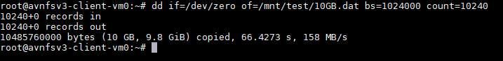
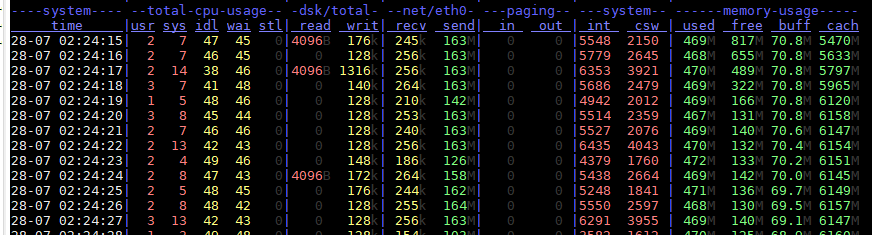
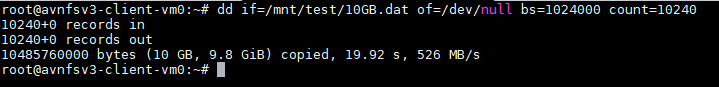
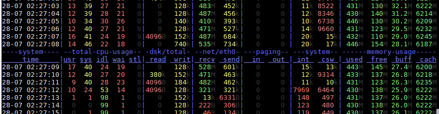
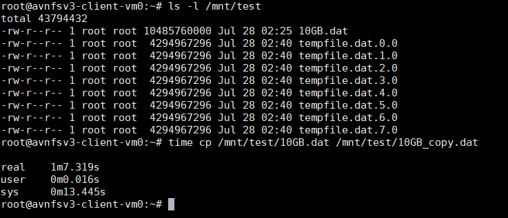
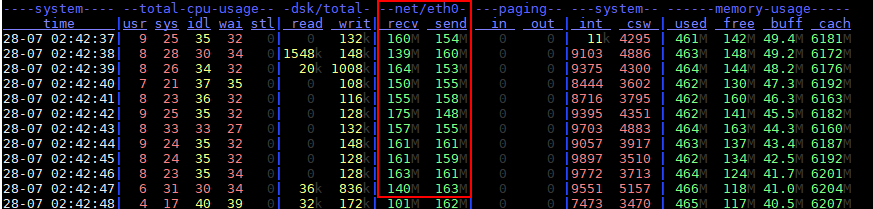
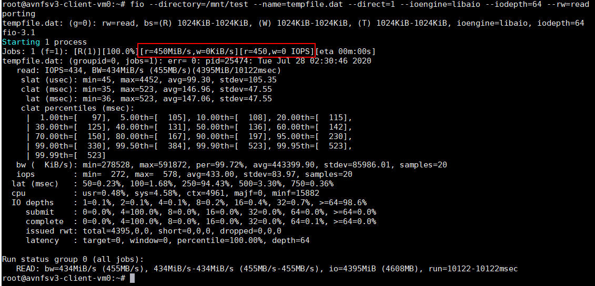
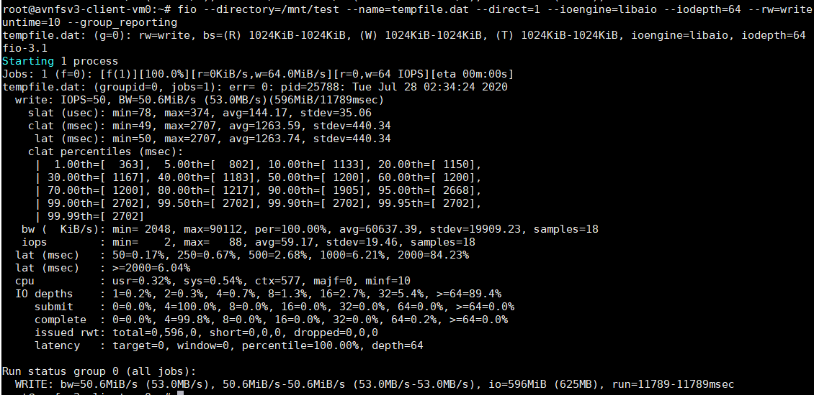
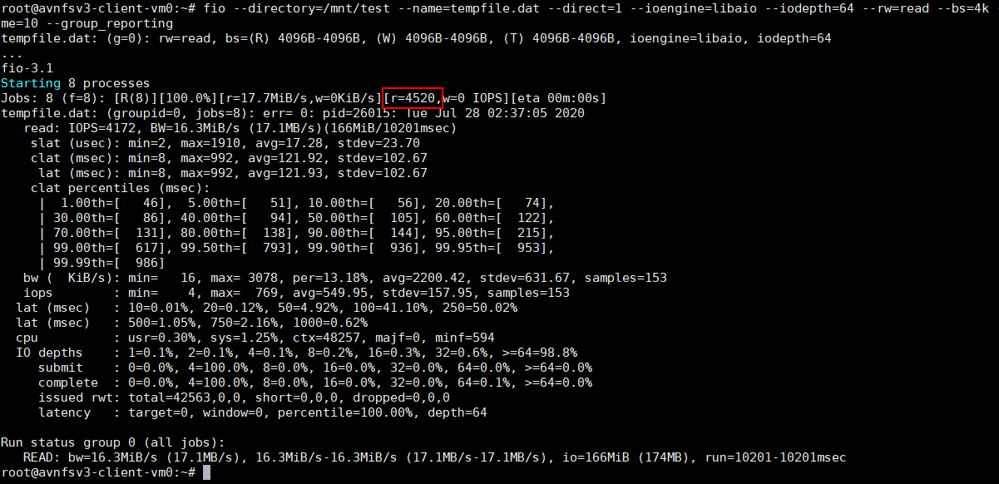

# Azure Blob Storage NFS v3 Test VM

This simple template deploys an NFS v3 enabled Azure Blob Storage account and a test VM to execute very simple performance tests.

See official documentation

* <https://azure.microsoft.com/en-us/blog/nfs-30-support-for-azure-blob-storage-is-now-in-preview/>
* <https://docs.microsoft.com/en-us/azure/storage/blobs/network-file-system-protocol-support>
* <https://docs.microsoft.com/en-us/azure/storage/blobs/network-file-system-protocol-support-how-to>

## Register

Register the NFS feature

```bash
az feature register --namespace Microsoft.Storage --name AllowNFSV3
az feature register --namespace Microsoft.Storage --name PremiumHns
az provider register -n Microsoft.Storage
```

Verify that feature is registered (this can take ~1 hour)

```bash
az feature show --namespace Microsoft.Storage --name AllowNFSV3
az feature show --namespace Microsoft.Storage --name PremiumHns
```

## Deploy

Deploy VNet, storage account, and client Ubuntu 18.04-LTS Standard_DS2_v2 VM for testing

Regions supported in preview as of 2020-07-27: East US, Central US, Canada Central

```bash
az group create --name avnfsv3 --location eastus
az deployment group create --resource-group avnfsv3 --template-file nfsv3-blobstorage-vm-template.json
```

## Mount

SSH into the client VM and mount NFS

```bash
sudo apt-get install -y nfs-common

sudo mkdir -p /mnt/test

sudo mount -o sec=sys,vers=3,nolock,proto=tcp avnfsv3ve4jktl4em35k.blob.core.windows.net:/avnfsv3ve4jktl4em35k/container1  /mnt/test
```

## Test

Install fio for disk testing and dstat for looking at perf counters

```bash
sudo apt-get install -y fio dstat

# In a separate SSH terminal open dstat to watch performance counters
dstat -tam -N eth0
```

dd sequential write of 10GB file

```bash
dd if=/dev/zero of=/mnt/test/10GB.dat bs=1024000 count=10240
```



dstat output showing per/sec network usage on eth0


dd sequential read of 10GB file

```bash
dd if=/mnt/test/10GB.dat of=/dev/null bs=1024000 count=10240
```



dstat output showing per/sec network usage on eth0


cp of 10GB file

```bash
time cp /mnt/test/10GB.dat /mnt/test/10GB_copy.dat
```



dstat output showing per/sec network usage on eth0


FIO read throughput using 1MB blocks and queue depth of 64

```bash
fio --directory=/mnt/test --name=tempfile.dat --direct=1 --ioengine=libaio --iodepth=64 --rw=read --bs=1024k --size=4G --numjobs=1 --time_based --runtime=10 --group_reporting
```



FIO write throughput using 1MB blocks and queue depth of 64

```bash
fio --directory=/mnt/test --name=tempfile.dat --direct=1 --ioengine=libaio --iodepth=64 --rw=write --bs=1024k --size=4G --numjobs=1 --time_based --runtime=10 --group_reporting
```



FIO read IOPS using 4KB blocks and 8 parallel jobs

```bash
fio --directory=/mnt/test --name=tempfile.dat --direct=1 --ioengine=libaio --iodepth=64 --rw=read --bs=4k --size=4G --numjobs=8 --time_based --runtime=10 --group_reporting
```



FIO write IOPS using 4KB blocks and 8 parallel jobs

```bash
fio --directory=/mnt/test --name=tempfile.dat --direct=1 --ioengine=libaio --iodepth=64 --rw=write --bs=4k --size=4G --numjobs=8 --time_based --runtime=10 --group_reporting
```


